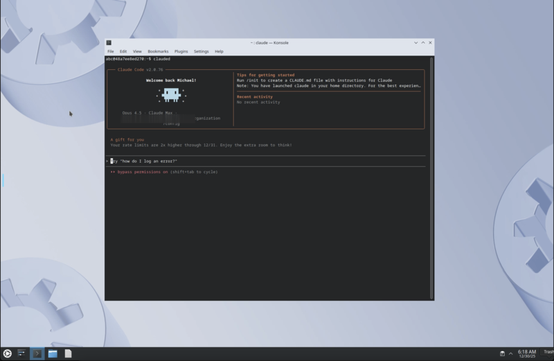
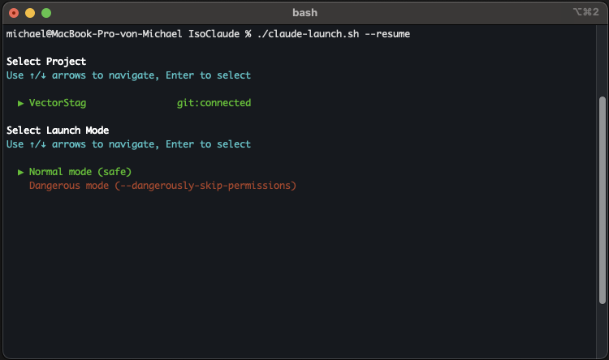

# IsoClaude

**Unleash Claude's full potential. No interruptions. No limits. Complete isolation.**

IsoClaude is a sandboxed Ubuntu environment that lets you run Claude Code in fully autonomous mode—where AI handles everything from file creation to git commits without asking permission for every command.



## The Problem

Claude Code asks permission for everything. `mkdir`? Permission. `ls`? Permission. `git status`? You guessed it.

You set Claude off on a task, walk away for coffee, and come back to find it stopped at step two—waiting for you to approve creating a directory.

Even with a carefully tuned `settings.json` allowlist, there are always edge cases. Some commands can't be pre-approved. Variations slip through. You're constantly interrupted.

## The Solution

IsoClaude gives Claude a full Ubuntu desktop where it can work autonomously—safely isolated from your host system. Your real files, your git history, your system configs? Untouchable. Claude gets a sandbox. You get your time back.

**What people are doing with IsoClaude:**
- 9+ hour autonomous coding sessions building entire features
- Greenfield project scaffolding from a single prompt
- Complex refactoring across dozens of files
- CI/CD pipeline development and testing
- Dependency upgrades with test verification

## Quick Start

```bash
# 1. Add your first project
./isoclaude.sh projects:add ~/projects/MyApp

# 2. Start the container
./isoclaude.sh up

# 3. Install dev tools (first time only)
./isoclaude.sh setup

# 4. Launch Claude
./isoclaude.sh claude
```

That's it. Select your project, choose dangerous mode, and let Claude work.

## The Claude Launcher

The launcher is your main interface—an interactive menu that lets you pick a project and mode, then drops you into Claude:



```bash
# Via isoclaude.sh
./isoclaude.sh claude                    # Interactive project & mode selection
./isoclaude.sh claude --resume           # Resume previous conversation
./isoclaude.sh claude --continue         # Continue last session
./isoclaude.sh claude -p "build a REST API"  # Start with a prompt

# Or call the launcher directly
./claude-launch.sh                       # Same interactive experience
./claude-launch.sh --resume              # Resume with picker
./claude-launch.sh -p "fix all tests"    # Start with prompt
```

The launcher:
1. Auto-starts the container if not running
2. Shows all mounted projects with git status indicators
3. Lets you choose Normal or Dangerous mode
4. Passes any extra arguments directly to Claude

Use arrow keys to navigate, Enter to select.

## Project Management

```bash
# List configured projects
./isoclaude.sh projects:list

# Add projects (excludes .git by default for safety)
./isoclaude.sh projects:add ~/projects/MyApp

# Add with git access (for commits/pushes)
./isoclaude.sh projects:add ~/projects/OpenSource true

# Remove by name or path
./isoclaude.sh projects:remove MyApp

# Apply changes
./isoclaude.sh down && ./isoclaude.sh up
```

Projects mount to `/projects/<folder_name>` inside the container.

### Git Isolation

By default, IsoClaude excludes `.git` folders—Claude works on your code but can't mess with your commit history. Set `include_git` to `true` when you want Claude to make commits.

## Commands

| Command | Description |
|---------|-------------|
| `./isoclaude.sh up` | Start the container |
| `./isoclaude.sh down` | Stop the container (data persists) |
| `./isoclaude.sh setup` | Install Python, Poetry, Rust, Node, Claude CLI |
| `./isoclaude.sh claude [args]` | Launch Claude in a project |
| `./claude-launch.sh [args]` | Direct launcher (same as above) |
| `./isoclaude.sh projects:list` | Show configured projects |
| `./isoclaude.sh projects:add` | Add a project mount |
| `./isoclaude.sh projects:remove` | Remove a project mount |
| `./isoclaude.sh regenerate` | Rebuild docker-compose.yml |

## What's Installed

After `./isoclaude.sh setup`:

- **Python** 3.12 + 3.13 with tkinter
- **Poetry** for dependency management
- **Rust** via rustup
- **Node.js** 20 + npm
- **Claude Code CLI** with `clauded` alias
- **VS Code** with Python, Rust Analyzer, and Claude Code extensions

## Access Methods

| Method | Address | Notes |
|--------|---------|-------|
| Desktop | http://localhost:3000 | Full KDE in browser |
| SSH | `ssh abc@localhost -p 2222` | Password: `isoclaude` |
| Shell | `docker exec -it iso-claude-ubuntu bash` | Direct access |

> **First thing**: Change the default SSH password with `passwd`

## Persistence

Everything survives restarts:
- Installed packages (apt, pip, npm, cargo)
- VS Code extensions and settings
- Claude conversation history
- Your project files (mounted from host)

To completely reset: `docker compose down -v`

## Best Practices

1. **Be specific** — "Build a REST API with user auth using FastAPI and SQLAlchemy" beats "make an API"
2. **Use project copies** — Mount copies of projects, not originals with uncommitted work
3. **Git everything** — Even with `.git` excluded, your host copy has version control
4. **Avoid secrets** — Don't mount directories with API keys or credentials
5. **Ask for documentation** — Tell Claude to document changes as it works

## Network Warning

Container isolation protects local files. It does **not** protect:
- Databases Claude can reach over the network
- APIs with credentials Claude has access to
- Cloud services, internal servers, production systems

If your container can reach it, Claude can affect it. Use test environments.

## Disclaimer

**USE AT YOUR OWN RISK.** The authors are not responsible for data loss, deleted files, or other damage from running Claude in autonomous mode. The `--dangerously-skip-permissions` flag is named that way for a reason.

Always maintain backups. Never mount irreplaceable data.

---

For Claude Code documentation: [claude.ai/code](https://claude.ai/code)
